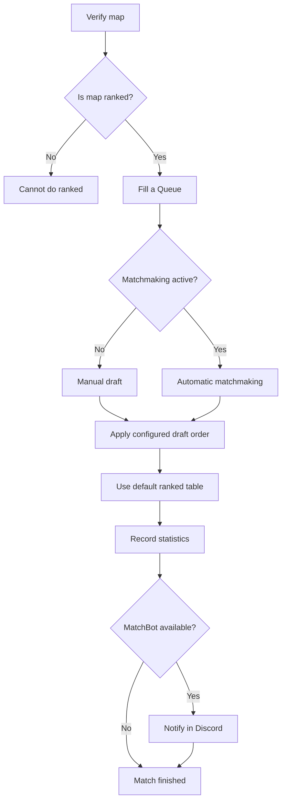

# Ranked System - TowersForPGM
## Configuration
### 1. Tables and maps
- **Create map list:** Go to the map you want to be available for ranked `/towers ranked addmap`
- **Create table:** use `towers ranked addtable <table name>`

You can repeat this step multiple times just make sure to use `/towers ranked defaulttable <table>` with the table you want to use.
### 2. Queue Size
- **Usage**: `/towers ranked size <num>`

### Draft Order
- **Format**: Must start with "A" and contain only "A" and "B"
- **Valid example**: "ABBAAB", "ABAB", "ABBABAAB"
- **Usage**: `/towers ranked order ABBAAB`

### Matchmaking System
- **States**: Enabled (true) or Disabled (false)
- **Usage**: `/towers ranked matchmaking <true/false>`

---

> [!TIP]  
> 🤖 **MatchBot Integration**: If you have MatchBot configured, additional functions for ranked will be added such as automatic Discord notifications when starting/ending a ranked and `/tag` command to notify when you want to start a ranked

---

## Available Commands

### Required Permissions
> [!IMPORTANT]  
> **Required permission**: `towers.admin` - Only administrators can configure the ranked system

### Base Command
```
/towers ranked
```

### Match Configuration

| Command | Description | Parameters |
|---------|-------------|------------|
| `size [number]` | **Match size** | Number between 2 and 12 (without parameter shows current) |
| `order [pattern]` | **Draft order** | Pattern like "ABBAAB" (without parameter shows current) |
| `matchmaking [true/false]` | **Enable matchmaking** | true/false (without parameter shows status) |

### Table Management

| Command | Description | Function |
|---------|-------------|---------|
| `addtable <table>` | **Create ranked table** | Creates a new specific table for rankeds |
| `deltable <table>` | **Delete ranked table** | Deletes an existing ranked table |
| `defaulttable <table>` | **Default table** | Sets the default table for rankeds |

### Map Management

| Command | Description | Function |
|---------|-------------|---------|
| `addmap` | **Add current map** | Adds current map to ranked maps list |
| `removemap` | **Remove current map** | Removes current map from ranked maps list |

---

## Ranked Map Management

### Adding Maps
1. **Go to map**: Enter the map you want to enable for ranked
2. **Execute command**: `/towers ranked addmap`
3. **Verify**: The map is automatically added to the list

### Removing Maps
1. **Go to map**: Enter the map you want to disable
2. **Execute command**: `/towers ranked removemap`
3. **Verify**: The map is removed from the ranked list

---

## Ranked Table Management

### Configuration Flow
1. **Create table**: `/towers ranked addtable TableName`
2. **Set as default**: `/towers ranked defaulttable TableName`
3. **Use in matches**: Statistics will be saved in that table

### Considerations
- Ranked tables are independent from normal tables
- Each ranked table is automatically created in the database
- You can have multiple tables for different types of ranked

---

## Ranked Match Flow



---

## Requirements for Ranked Matches

### Basic Configuration
| Requirement | Command | Status |
|-----------|---------|--------|
| **Enabled map** | `/towers ranked addmap` | Mandatory |
| **Configured table** | `/towers ranked addtable` | Mandatory |
| **Defined size** | `/towers ranked size` | Mandatory |
| **Draft order** | `/towers ranked order` | Optional |

### Advanced Configuration
| Feature | Description | Command |
|----------------|-------------|---------|
| **Matchmaking** | Automatic pairing system | `/towers ranked matchmaking true` |
| **MatchBot** | Discord notifications | External configuration |
| **Multiple tables** | Different seasons/tournaments | `/towers ranked addtable` |

---

## Related Links

- 🤖 [MatchBot System](Matchbot.md)
- 📊 [Statistics System](Stats.md)
- ⚔️ [Draft System](Draft.md)
- ⏱️ [Preparation Time](Preparation%20Time.md)
- 🔄 [Refill System](Refill.md)
